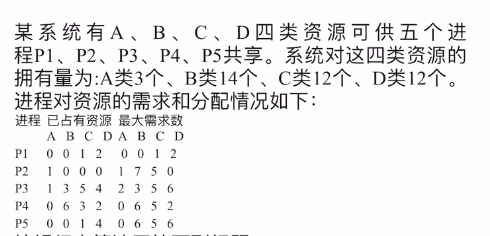

**1.银行家算法**

在资源分配前判断，如果分配后系统会进入不安全状态，就不分配，从而避免死锁。

**安全状态**：如果系统能够按某种顺序为每个进程分配资源，使每个进程都能顺利执行完毕，则称系统处于**安全状态**。

**第一类题**
系统有 3 个进程 P1、P2、P3，两类资源 A、B。

|进程|Max(A,B)|Allocation(A,B)|
|---|---|---|
|P1|(4,3)|(1,1)|
|P2|(3,2)|(1,0)|
|P3|(5,3)|(2,1)|

当前：

```text
Available = (2,2)
```

请回答：

```text
1. Need：
P1 =
P2 =
P3 =

2. 当前哪些进程可以先完成？

3. 找出一个安全序列。

4. 系统是否安全？
```

> [!NOTE] 注
> 这里的Available可以计算的，比如说这道题
> 
> 我们可以通过总的资源数减去已占有的资源数就是Available
> 放在这道题里面就是：（3,14,12,12)-(p1+p2+p3+p4+p5)的已占有资源数


