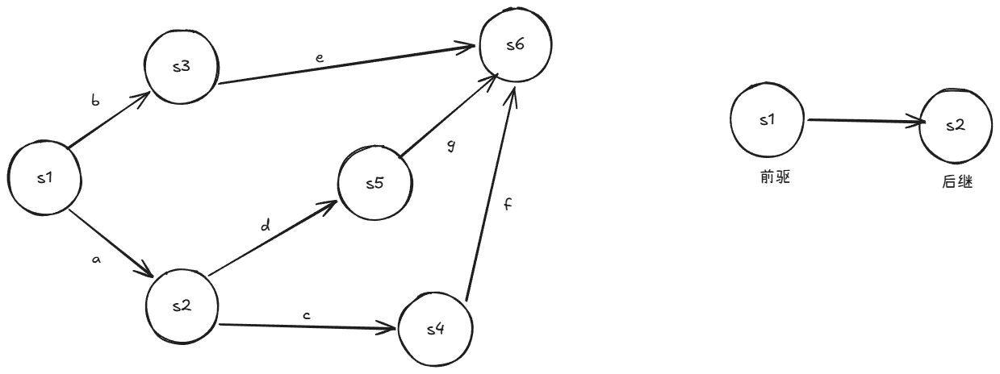
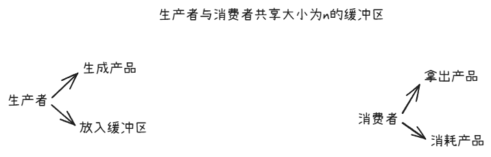
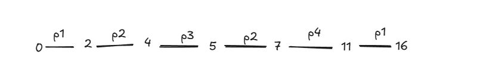

# 磁盘调度算法

例：
```
磁头：100
排序：18 38 39 55 58 90 100（磁头）150 160 184
磁盘范围：0-199
```
## 一、FCFS：先来先服务

规则：

> 按请求到达顺序访问磁道。

优点：简单、公平。  
缺点：磁头可能来回大幅移动，效率低。

```
100 → 18 → 38 → 39 → 55 → 58 → 90 → 150 → 160 → 184
```

总移动量：

```
|100-18| + |18-38| + |38-39| + |39-55| + |55-58| + |58-90| + |90-150| + |150-160| + |160-184|
= 82 + 20 + 1 + 16 + 3 + 32 + 60 + 10 + 24
= 248
```

注意：FCFS 真正要看“原始请求顺序”，不是排序后的顺序。

## 二、SSTF：最短寻道时间优先

规则：

> 每次选择距离当前磁头最近的请求。

关键词：

```
谁离我最近，先访问谁。
```

优点：平均寻道时间较短。  
缺点：远处请求可能长期得不到服务，产生“饥饿”。

每次选择离当前磁头最近的请求。

从 100 开始：

```
100 → 90 → 58 → 55 → 39 → 38 → 18 → 150 → 160 → 184
```

总移动量：

```
10 + 32 + 3 + 16 + 1 + 20 + 132 + 10 + 24 = 248
```
## 三、SCAN：扫描算法 / 电梯算法

规则：

> 磁头像电梯一样，沿一个方向移动，服务沿途请求；到达磁盘一端后，再反向移动。

关键词：

```
一路扫到底，再返回。
```

先向大磁道服务，到磁盘末端 184，再反向。

```
100 → 150 → 160 → 184 → 199 → 90 → 58 → 55 → 39 → 38 → 18
```

注意：  
SCAN 通常要走到磁盘端点，再反向。

## 四、C-SCAN：循环扫描

规则：

> 磁头只按一个方向服务，到达磁盘一端后，直接回到另一端，再继续同方向服务。

关键词：

```
从小到大排序，磁头开始向增方向走，之后从头开始
```

如果方向向大磁道：

```
当前 → 大磁道请求 → 磁盘最大端 → 磁盘最小端 → 小磁道请求
```

优点：

```
等待时间更均匀。
```

```
100 → 150 → 160 → 184 → 199 → 0 → 18 → 38 → 39 → 55 → 58 → 90
```

---
# 页面置换算法

## 一、FIFO 先进先出

规则：

> 淘汰最早进入内存的页面。

也就是说，谁最早进来，谁先出去。访问命中时，顺序不变。

|访问页|内存状态|是否缺页|说明|
|---|---|---|---|
|4|[4]|缺页|装入 4|
|1|[4,1]|缺页|装入 1|
|2|[4,1,2]|缺页|装入 2|
|5|[1,2,5]|缺页|淘汰最早的 4|
|3|[2,5,3]|缺页|淘汰 1|
|4|[5,3,4]|缺页|淘汰 2|
|6|[3,4,6]|缺页|淘汰 5|
|3|[3,4,6]|命中|3 已在内存|
|1|[4,6,1]|缺页|淘汰 3|
|2|[6,1,2]|缺页|淘汰 4|

所以：

```
FIFO 缺页次数 = 9
缺页率 = 9 / 10
```

## 二、LRU 最近最久未使用

规则：

> 淘汰最近最久没有被访问的页面。

也就是看过去，谁最久没用，淘汰谁。

|访问页|内存状态|是否缺页|说明|
|---|---|---|---|
|4|[4]|缺页|装入 4|
|1|[4,1]|缺页|装入 1|
|2|[4,1,2]|缺页|装入 2|
|5|[1,2,5]|缺页|4 最久没用，淘汰 4|
|3|[2,5,3]|缺页|1 最久没用，淘汰 1|
|4|[5,3,4]|缺页|2 最久没用，淘汰 2|
|6|[3,4,6]|缺页|5 最久没用，淘汰 5|
|3|[4,6,3]|命中|3 被重新访问，变成最近使用|
|1|[6,3,1]|缺页|4 最久没用，淘汰 4|
|2|[3,1,2]|缺页|6 最久没用，淘汰 6|

所以：

```
LRU 缺页次数 = 9
缺页率 = 9 / 10
```

注意：LRU 命中时要更新“最近使用时间”。这和 FIFO 不一样。

---

## 三、OPT 最佳置换

规则：

> 淘汰未来最长时间不再访问的页面；如果某页以后不再访问，优先淘汰。

OPT 要看后面的整个访问序列。

| 访问页 | 内存状态    | 是否缺页 | 说明              |
| --- | ------- | ---- | --------------- |
| 4   | [4]     | 缺页   | 装入 4            |
| 1   | [4,1]   | 缺页   | 装入 1            |
| 2   | [4,1,2] | 缺页   | 装入 2            |
| 5   | [4,1,5] | 缺页   | 未来 2 最晚再访问，淘汰 2 |
| 3   | [4,1,3] | 缺页   | 5 以后不再访问，淘汰 5   |
| 4   | [4,1,3] | 命中   | 4 在内存           |
| 6   | [6,1,3] | 缺页   | 4 以后不再访问，淘汰 4   |
| 3   | [6,1,3] | 命中   | 3 在内存           |
| 1   | [6,1,3] | 命中   | 1 在内存           |
| 2   | [2,1,3] | 缺页   | 最后一次访问，淘汰任意页    |

所以：

```
OPT 缺页次数 = 7
缺页率 = 7 / 10
```

---
# 银行家算法

## 题目

系统有 5 个进程 `P0~P4`，4 类资源 `A、B、C、D`。

系统资源总量：

```
Total = (10, 5, 7, 7)
```

当前分配情况：

|进程|Max|Allocation|
|---|---|---|
|P0|(7,5,3,4)|(0,1,0,2)|
|P1|(3,2,2,2)|(2,0,0,1)|
|P2|(9,0,2,2)|(3,0,2,0)|
|P3|(2,2,2,2)|(2,1,1,1)|
|P4|(4,3,3,3)|(0,0,2,1)|

问题：

```
1. 求 Available。
2. 判断系统是否安全，若安全，给出安全序列。
3. 若 P4 请求 Request4 = (1,1,0,0)，能否立即分配？
```

---
# 逻辑地址和物理地址的转换

## 1.连续分配中的地址转换

如果一个进程被连续装入内存，通常用：

```
物理地址 = 基址 + 逻辑地址
```

其中：

```
基址 = 进程在内存中的起始地址
```

例：

```
基址 = 2000
逻辑地址 = 350
```

则：

```
物理地址 = 2000 + 350 = 2350
```

如果题目给了限长，还要判断是否越界：

```
逻辑地址 < 限长：合法
逻辑地址 >= 限长：越界
```

## 2.分页存储中的地址转换

### 如果题目直接给页号和偏移

页大小：

```
1024B
```

页表：

|页号|页框号|
|---|---|
|0|5|
|1|3|
|2|8|

逻辑地址：

```
页号 = 2
页内偏移 = 100
```

查页表：

```
页号 2 → 页框号 8
```

所以：

```
物理地址 = 8 × 1024 + 100 = 8292
```

---

### 如果题目只给逻辑地址

比如：

```
页大小 = 1024B
逻辑地址 = 2500
```

先拆：

```
页号 = 2500 ÷ 1024 的商 = 2
页内偏移 = 2500 ÷ 1024 的余数 = 452
```

然后查页表，再算物理地址。

模板：

```
页号 = 逻辑地址 / 页大小 的商
页内偏移 = 逻辑地址 / 页大小 的余数
物理地址 = 页框号 × 页大小 + 页内偏移
```

## 3.分段存储中的地址转换

分段地址结构是：

```
段号 + 段内偏移量
```

段表中通常有：

```
段基址
段长
```

转换规则：

```
如果 段内偏移 < 段长：
    物理地址 = 段基址 + 段内偏移
否则：
    越界
```

---

例：

段表：

|段号|段基址|段长|
|---|---|---|
|0|1000|500|
|1|3000|800|

逻辑地址：

```
段号 = 1
段内偏移 = 200
```

判断：

```
200 < 800
```

合法。

物理地址：

```
3000 + 200 = 3200
```

如果偏移是 `900`：

```
900 >= 800
```

则：

```
越界
```
# pv操作/信号量

## 1.利用信号实现前驱关系DAG


**解**：
1.有几个箭头，就设几个信号量
2.从根节点开始
3.有n个前驱节点就写n个wait()，有m个后继就写m个signal()


```
semaphore a,b,c,d,e,f,g

begin
	parbegin
		begin s1;signal(b);signal(a);end;
		begin wait(a);s2;signal(d);signal(c);end;
		begin wait(b);s3;signal(e);end;
		begin wait(c);s4;signal(f);end;
		begin wait(d);s5;signal(g);end;
		begin wait(e);wait(g);wait(f);end;
	parend
end
```

例：

## 2.生产者与消费者问题



```
semaphore mutex=1,empty=n,full=0;
producer(){
	while(1){
	}
}
```

# 处理机调度算法

## 通用公式

```
周转时间 = 完成时间 - 到达时间
带权周转时间 = 周转时间 / 运行时间
等待时间 = 周转时间 - 运行时间
```

其中：

- 到达时间：进程进入就绪队列的时间
- 运行时间：也叫服务时间，需要 CPU 执行多久
- 完成时间：进程执行结束的时间
- 周转时间：从到达到完成，总共花了多久
- 等待时间：没在 CPU 上运行、在队列里等的时间

**统一例题**

|进程|到达时间|运行时间|优先数|
|---|---|---|---|
|P1|0|7|1|
|P2|2|4|2|
|P3|4|1|3|
|P4|5|4|2|
## 1.先来先服务-FCFS（非抢占式）

规则：

```
谁先到，谁先执行，非抢占。
```

按到达时间：

```
P1 → P2 → P3 → P4
```

时间轴：

```
0      7      11 12     16
|--P1--|--P2--|P3|--P4--|
```

完成时间：

```
P1=7，P2=11，P3=12，P4=16
```

周转时间：

```
P1=7-0=7
P2=11-2=9
P3=12-4=8
P4=16-5=11
```

平均周转时间：

```
(7+9+8+11)/4 = 35/4 = 8.75
```


## 2. SJF/SPF 短作业优先，非抢占

规则：

```
每次 CPU 空闲时，在已经到达的进程中选运行时间最短的。
```

注意：不是全局最短，是**已经到达**中最短。

时间 0 只有 P1 到达，所以先 P1。  
时间 7 时，P2、P3、P4 都已到达，选最短的 P3。

执行顺序：

```
P1 → P3 → P2 → P4
```

时间轴：

```
0      7 8      12     16
|--P1--|P3|--P2--|--P4--|
```

完成时间：

```
P1=7，P2=12，P3=8，P4=16
```

周转时间：

```
P1=7
P2=12-2=10
P3=8-4=4
P4=16-5=11
```

平均周转时间：

```
(7+10+4+11)/4 = 8
```

## 3.SRTN 最短剩余时间优先，抢占

规则：

```
谁剩余运行时间最短，谁运行；新进程到达时可能抢占。
```

过程：

- 0 时 P1 运行。
- 2 时 P2 到达，P1 剩 5，P2 只要 4，所以 P2 抢占。
- 4 时 P3 到达，P2 剩 2，P3 只要 1，所以 P3 抢占。
- P3 完成后，继续选剩余最短的。

时间轴：

```
0  2  4 5  7     11     16
|P1|P2|P3|P2|--P4--|--P1--|
```

完成时间：

```
P1=16，P2=7，P3=5，P4=11
```

周转时间：

```
P1=16-0=16
P2=7-2=5
P3=5-4=1
P4=11-5=6
```

平均周转时间：

```
(16+5+1+6)/4 = 7
```

## 4. 优先级调度

### 非抢占式

默认：

```
优先数越小，优先级越高。
```

时间 0 只有 P1，所以先 P1。  
时间 7 后，P2 优先数 2，P3 优先数 3，P4 优先数 2。  
P2 和 P4 优先级相同，P2 先到，所以 P2 先。

执行顺序：

```
P1 → P2 → P4 → P3
```

时间轴：

```
0      7      11     15 16
|--P1--|--P2--|--P4--|P3|
```

完成时间：

```
P1=7，P2=11，P3=16，P4=15
```

周转时间：

```
P1=7
P2=9
P3=16-4=12
P4=15-5=10
```

平均周转时间：

```
(7+9+12+10)/4 = 9.5
```

如果题目规定“优先数越大优先级越高”，顺序会变成：

```
P1 → P3 → P2 → P4
```

### 抢占式

时间轴


## 5. HRRN 高响应比优先

规则：

```
响应比 = (等待时间 + 运行时间) / 运行时间
```

也就是：

```
响应比 = 1 + 等待时间 / 运行时间
```

非抢占。

时间 0 只有 P1：

```
先执行 P1：0~7
```

时间 7，计算剩下进程响应比：

```
P2 等待 = 7-2 = 5，响应比 = (5+4)/4 = 2.25
P3 等待 = 7-4 = 3，响应比 = (3+1)/1 = 4
P4 等待 = 7-5 = 2，响应比 = (2+4)/4 = 1.5
```

选响应比最高的 P3。

时间 8，再算：

```
P2 等待 = 8-2 = 6，响应比 = (6+4)/4 = 2.5
P4 等待 = 8-5 = 3，响应比 = (3+4)/4 = 1.75
```

选 P2，最后 P4。

执行顺序：

```
P1 → P3 → P2 → P4
```

结果和这题的 SJF 一样：

```
完成时间：P1=7，P2=12，P3=8，P4=16
平均周转时间 = 8
```

---

## 6. RR 时间片轮转

排队的顺序：久等的进程>卡点到达的进程>刚被换下的进程

RR 必须给时间片。这里我先假设：

```
时间片 q = 2
```

规则：

```
每个进程最多运行 2 个时间单位；
没运行完就回到就绪队列队尾。
```

时间轴：

```
0  2  4  6 7  9   11  13  15 16
|P1|P2|P1|P3|P2|P4|P1|P4|P1|
```

完成时间：

```
P1=16，P2=9，P3=7，P4=15
```

周转时间：

```
P1=16-0=16
P2=9-2=7
P3=7-4=3
P4=15-5=10
```

平均周转时间：

```
(16+7+3+10)/4 = 9
```

注意：RR 的关键是维护队列，不是看谁短。

## 7.多级反馈队列

口决：

**新进程，进一队；有高队，先跑高；时间片，用完降；被打断，剩片续**


| 进程  | 到达时间 | 运行时间 |
| --- | ---- | ---- |
| P1  | 0    | 6    |
| P2  | 1    | 3    |
| P3  | 2    | 4    |
| P4  | 3    | 2    |

```
有 3 个队列：Q1、Q2、Q3
Q1 时间片 = 1
Q2 时间片 = 2
Q3 时间片 = 4
新进程进入 Q1
Q1 优先级最高，Q2 次之，Q3 最低
同一队列内部采用 FCFS
进程在某级队列用完时间片仍未完成，则降到下一级队列队尾
若低级队列进程运行时，有新进程进入更高级队列，则立即抢占
```