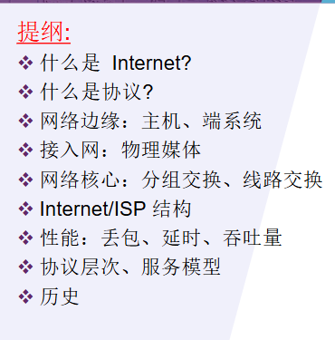

## 计算机概念


**1.什么是计算机网络？**

计算机网络是通过通信链路和交换设备连接起来、以实现资源共享和信息交换为目的的自治计算机系统集合。

**2.Internet的组成**

Internet 由端系统、通信链路、分组交换设备/网络核心、接入网络以及各种协议组成。

**3.什么是网络协议**

协议规定通信实体之间交换报文的格式、顺序，以及发送或接收报文后应采取的动作。三要素是**语法、语义、时序**。

**4.Internet与internet的区别**

**internet**：泛指“互联的网络”，任何多个网络互连都可以叫 internet。  
**Internet**：专指全球公共互联网，是运行 TCP/IP 协议族的那个全球网络。

**5**.Web、邮件等应用程序主要运行在**网络边缘的端系统**上；网络核心中的路由器主要负责**分组转发和路由选择**，通常不运行用户应用程序。


## 协议、分层、封装

#### 1.什么是网络协议？协议三要素是什么？

协议规定通信实体之间交换报文的格式、顺序，以及发送或接收报文后采取的动作。协议三要素是**语法、语义、时序**。

#### 2.为什么计算机网络要采用分层结构？

计算机网络采用分层结构，是为了降低系统复杂性。每一层完成特定功能，向上层提供服务，使用下层提供的服务。分层有利于模块化设计、标准化、维护和协议替换。

#### 3.“每层只和相邻层交互，同层之间通过协议通信”这句话对吗？解释一下。

每一层只通过接口与相邻层交换信息；同层实体之间遵守相同协议进行逻辑通信，但实际数据传输仍要依靠下层完成。

#### 4.发送端数据从应用层到物理层时，发生的是封装还是解封装？

**发送向下：加首部，封装。**  
**接收向上：去首部，解封装。**

5.

|层次|发送端封装|形成的 PDU|主要信息|
|---|---|---|---|
|应用层|产生应用数据|报文 message|HTTP、DNS、SMTP 等应用数据|
|传输层|加 TCP/UDP 首部|报文段 segment|源端口、目的端口，TCP 还有序号、确认号等|
|网络层|加 IP 首部|数据报/分组 datagram/packet|源 IP、目的 IP、TTL、协议字段|
|数据链路层|加帧首部和帧尾部|帧 frame|源 MAC、目的 MAC、类型、CRC/FCS|
|物理层|转换为电信号/光信号/无线信号|比特 bit|0 和 1 的传输|

**完整流程**：

```
发送端：
应用层报文
→ 传输层加 TCP/UDP 首部：报文段
→ 网络层加 IP 首部：IP 数据报
→ 链路层加 MAC 首部 + CRC 尾部：帧
→ 物理层：比特流发送

接收端：
物理层收到比特流
→ 链路层还原帧，检查 CRC，去掉链路层首尾
→ 网络层检查目的 IP，去掉 IP 首部
→ 传输层根据端口号交给对应进程，去掉 TCP/UDP 首部
→ 应用层得到原始报文
```

## 网络边缘、网络核心、分组交换与电路交换

#### **1. 网络边缘、接入网、网络核心**

|部分|含义|典型设备/内容|
|---|---|---|
|网络边缘|离用户最近，运行网络应用的部分|主机、服务器、手机、客户端|
|接入网|把端系统接入网络核心的网络|WiFi、以太网、DSL、光纤、4G/5G|
|网络核心|负责把分组从源主机送到目的主机|路由器、高速链路、交换设备|
考试模板：

> Internet 可以从结构上分为网络边缘、接入网和网络核心。网络边缘由端系统组成，运行 Web、邮件等应用程序；接入网负责将端系统连接到网络核心；网络核心由路由器和高速链路组成，主要负责分组转发和路由选择。

#### **2. 分组交换**

一句话：  
**分组交换把数据切成一个个分组，在网络中逐跳存储转发。**

核心机制：

```
大数据 → 切成分组 → 每个分组带首部 → 路由器逐跳转发 → 到达目的端再重组
```

关键点：

- 使用**存储转发**：路由器必须收到完整分组后，才能转发到下一跳。
- 多个用户共享链路，属于**统计复用**。
- 可能出现排队时延、丢包。
- 适合突发性强的数据通信，是 Internet 的主要交换方式。

#### **3. 电路交换**

一句话：  
**电路交换通信前先建立一条专用通信线路，通信期间资源独占。**

三个阶段：

```
建立连接 → 数据传输 → 释放连接
```

典型复用方式：

- **FDM**：频分复用，把频带分成多个子频带。
- **TDM**：时分复用，把时间分成固定时隙。

特点：

- 通信前要建立连接。
- 资源独占，传输稳定。
- 连接建立后通常没有排队时延。
- 但用户空闲时资源也不能被别人使用，容易浪费。
- 更适合传统电话网这类连续稳定通信。


#### 4.电路交换VS分组交换

|比较项|电路交换|分组交换|
|---|---|---|
|是否建立连接|通信前建立专用电路|通常不需要专用电路|
|资源分配|独占资源|共享资源|
|传输单位|连续比特流|分组|
|复用方式|FDM / TDM|统计复用|
|空闲时资源|仍被占用，可能浪费|可被其他用户使用|
|时延特点|建立连接后稳定|可能排队、丢包|
|适合场景|连续稳定业务|突发数据业务|
|典型网络|电话网|Internet|
```
电路交换通信前需要建立专用电路，通信期间独占资源，通常采用 FDM 或 TDM，传输连续比特流，适合连续稳定业务；
分组交换通常不建立专用电路，将数据划分为分组逐跳存储转发，采用统计复用，多个用户共享链路，适合突发数据业务，但可能产生排队时延和丢包。
```

## 计算机网络协议的三种体系结构

#### 1.**OSI 七层模型**

从上到下：

```
应用层
表示层
会话层
传输层
网络层
数据链路层
物理层
```

口诀：  
**应表会传网数物**

每层大致功能：

|层次|主要功能|
|---|---|
|应用层|为用户应用提供网络服务|
|表示层|数据格式转换、加密、压缩|
|会话层|建立、管理、终止会话|
|传输层|进程到进程通信，可靠传输、流量控制|
|网络层|主机到主机通信，路由选择、分组转发|
|数据链路层|相邻结点之间传输帧，差错检测、MAC|
|物理层|比特流传输|

#### **2. TCP/IP 五层模型**

你课件里重点是五层模型：

```
应用层
传输层
网络层
数据链路层
物理层
```

口诀：  
**应传网数物**

PDU 对应：

```
应用层：报文
传输层：报文段
网络层：数据报/分组
数据链路层：帧
物理层：比特
```

#### 3.为什么要分层？

分层可以降低网络系统复杂性，使各层功能相对独立。每层向上层提供服务，使用下层服务，有利于模块化设计、标准化、维护和协议替换。
