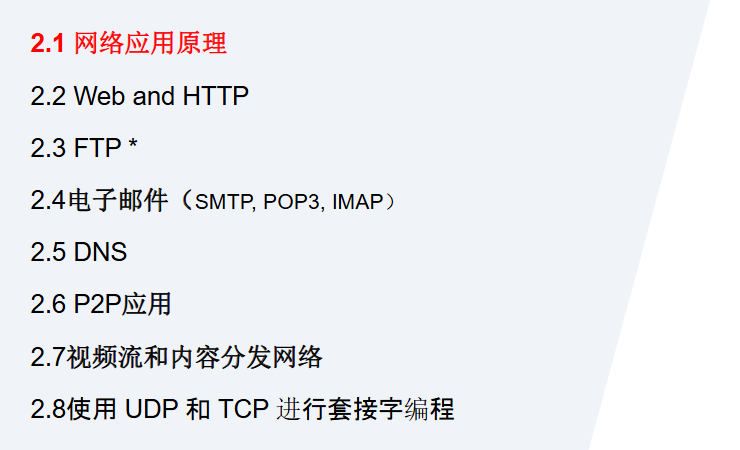

## 网络应用原理

#### 1.网络应用体系结构
- 客户-服务器模式（C/S:client/server） 

- 对等模式(P2P:Peer To Peer) 

- 混合体：客户-服务器和对等体系结构
#### 2.什么是socket？

socket 不是协议，它是**应用层和运输层之间的接口**。

#### 3.在网络中标识一个应用进程通常需要？

IP 地址 + 端口号

#### 4.应用层协议通常规定哪些内容？

定义报文类型、格式、字段含义、发送/响应规则

#### 5.TCP 和 UDP 分别能为应用提供什么类型的运输服务？

TCP 为应用提供面向连接、可靠、按序交付的字节流服务，并提供流量控制和拥塞控制。
UDP 提供无连接、不可靠的报文交付服务，开销小、时延低，但不保证可靠性和按序到达。

---
## web和http

#### 1.什么是http

HTTP，即 HyperText Transfer Protocol，超文本传输协议，是 Web 的应用层协议，规定浏览器和 Web 服务器之间请求报文与响应报文的格式及交互规则。HTTP **通常使用 TCP**，默认端口号是 **80**。

#### 2.核心机制

```
用户输入 URL
→ 浏览器建立 TCP 连接
→ 浏览器发送 HTTP 请求报文
→ 服务器返回 HTTP 响应报文
→ 浏览器解析 HTML，并继续请求图片、CSS、JS 等对象
```

#### 3.非持续连接 vs 持续连接

| 比较项     | 非持续 HTTP            | 持续 HTTP           |
| ------- | ------------------- | ----------------- |
| TCP 连接  | 每请求一个对象就建立一次 TCP 连接 | 多个对象可复用同一个 TCP 连接 |
| 开销      | 大，反复握手和关闭连接         | 小，减少连接建立开销        |
| 时延      | 每个对象通常至少 2RTT       | 多个对象传输更快          |
| HTTP 版本 | HTTP/1.0 常见         | HTTP/1.1 默认       |

#### 4.为什么http是无状态协议

HTTP 是无状态协议，指**服务器默认不会保存客户端以前请求的状态信息**。每个请求相互独立，服务器不会自动记住同一用户之前的访问行为。

#### 5.http为什么通常使用TCP而不是UDP

HTTP 传输 Web 对象，需要可靠、按序的数据传输；TCP 能提供面向连接、可靠传输、按序交付和拥塞控制，所以 HTTP 通常运行在 TCP 之上。

#### 6.关键点

| 项目      | 考试要点                     |
| ------- | ------------------------ |
| Web 页   | 由多个对象组成，如 HTML、图片、CSS、JS |
| URL     | 定位资源，常见格式：协议://主机名/路径    |
| HTTP    | 应用层协议，使用 TCP             |
| HTTP 特点 | 无状态、请求-响应式               |
| 默认端口    | HTTP 80；HTTPS 常用 443     |
| 无状态     | 服务器默认不保存客户端上一次请求状态       |

#### 7.RTT的计算

---

## HTTP 请求报文、响应报文、状态码

**HTTP 报文分两类**

|类型|谁发送|作用|
|---|---|---|
|请求报文|客户端 → 服务器|请求某个 Web 对象|
|响应报文|服务器 → 客户端|返回对象或错误信息|

#### 1.请求报文

基本结构：

```
请求行
首部行
空行
实体体
```

请求行格式：

```
方法 URL 版本
```

例子：

```
GET /index.html HTTP/1.1
Host: www.example.com
User-Agent: ...
Accept: ...
```

常见方法：

| 方法     | 含义                    |
| ------ | --------------------- |
| GET    | 请求获取资源                |
| HEAD   | 类似 GET，但只返回响应首部，不返回实体 |
| POST   | 向服务器提交数据              |
| PUT    | 上传/替换服务器上的资源          |
| DELETE | 删除服务器上的资源             |

#### 2.响应报文

基本结构：

```
状态行
首部行
空行
实体体
```

状态行格式：

```
版本 状态码 短语
```

例子：

```
HTTP/1.1 200 OK
Content-Type: text/html
Content-Length: ...
```

#### 3.状态码分类

|状态码|含义|常见例子|
|---|---|---|
|1xx|信息性响应|很少考|
|2xx|成功|200 OK|
|3xx|重定向|301 Moved Permanently|
|4xx|客户端错误|400 Bad Request、404 Not Found|
|5xx|服务器错误|500 Internal Server Error|

高频状态码：

- **200 OK**：请求成功
- **301 Moved Permanently**：资源永久移动
- **400 Bad Request**：请求报文有语法错误
- **404 Not Found**：请求资源不存在
- **505 HTTP Version Not Supported**：服务器不支持请求的 HTTP 版本

**易错点**

1. 请求报文第一行叫**请求行**；响应报文第一行叫**状态行**。
2. GET 通常用于获取资源，POST 通常用于提交数据。
3. 404 是客户端请求的资源不存在，不是服务器崩了。
4. 500 才是服务器内部错误。
5. HEAD 不返回实体体，只返回首部。

---

## Cookie、Web 缓存、条件 GET

#### 1.Cookie

一句话说明：  
**Cookie 用来在无状态的 HTTP 上维持用户状态。**

为什么需要 Cookie：  
HTTP 本身无状态，服务器默认不保存用户历史请求。但很多应用需要识别用户，比如登录、购物车、个性化推荐。

Cookie 机制包含四部分：

|部分|作用|
|---|---|
|HTTP 响应报文中的 `Set-Cookie` 首部|服务器要求浏览器保存 Cookie|
|HTTP 请求报文中的 `Cookie` 首部|浏览器之后请求时携带 Cookie|
|用户端浏览器保存的 Cookie 文件|存储用户标识等信息|
|服务器端数据库|根据 Cookie 标识查找用户状态|

流程：

```
首次访问服务器
→ 服务器返回响应，包含 Set-Cookie
→ 浏览器保存 Cookie
→ 后续请求自动带 Cookie 首部
→ 服务器根据 Cookie 识别用户
```

#### **2. Web 缓存**

一句话说明：  
**Web 缓存通过保存 Web 对象副本，减少访问时延和网络流量。**

Web 缓存也叫代理服务器 proxy cache。  
浏览器可以先向缓存请求对象，如果缓存有并且未过期，就直接返回；否则缓存再向原始服务器请求。

优点：

- 减少客户端响应时间
- 减少机构接入链路流量
- 降低原始服务器负载
- 在一定程度上提高访问可用性

#### **3. 条件 GET**

一句话说明：  
**条件 GET 用来判断缓存副本是否仍然是最新的。**

关键首部：

```
If-Modified-Since
```

流程：

```
缓存已有对象副本
→ 向服务器发送条件 GET，带 If-Modified-Since
→ 如果对象未修改：服务器返回 304 Not Modified，不返回对象实体
→ 如果对象已修改：服务器返回 200 OK 和新的对象
```

**高频区别**

|机制|解决的问题|
|---|---|
|Cookie|HTTP 无状态下识别用户、维持状态|
|Web 缓存|减少访问时延和网络流量|
|条件 GET|验证缓存对象是否最新，避免重复传输未修改对象|

**易错点**

1. Cookie 不是让 HTTP 变成“有状态协议”，而是在无状态 HTTP 上实现状态维护。
2. Cookie 通常由浏览器保存，并在后续请求中携带。
3. Web 缓存不是 DNS，它缓存的是 Web 对象，不是域名解析结果。
4. 条件 GET 中未修改返回 **304 Not Modified**，不是 404。
5. 对象已修改才返回 **200 OK + 新对象**。

---

## FTP

**一句话说明**  
FTP 解决的是：**客户端和远程服务器之间进行文件传输。**

**正式定义**  
FTP，即 File Transfer Protocol，文件传输协议，是应用层协议，采用客户-服务器方式，通过 TCP 在客户端和 FTP 服务器之间传输文件。

**核心机制：两个连接**

|连接|作用|常见端口|
|---|---|---|
|控制连接|传输命令和响应|TCP 21|
|数据连接|传输文件数据|TCP 20 常见于主动模式|

考试最重要的一句话：

> FTP 使用分离的控制连接和数据连接，控制信息与文件数据分开传输。

**FTP 工作流程**

```
客户端与服务器建立控制连接
→ 用户登录认证
→ 客户端发送命令，如上传、下载、列目录
→ 需要传输数据时建立数据连接
→ 文件传输完成后关闭数据连接
→ 控制连接可继续保持，用于后续命令
```

**FTP 与 HTTP 对比**

|比较项|FTP|HTTP|
|---|---|---|
|主要用途|文件上传/下载|Web 对象传输|
|连接|控制连接 + 数据连接|通常一个 TCP 连接传请求/响应|
|状态|有状态，需要维护用户会话|无状态|
|传输协议|TCP|TCP|
|端口|21 控制，20 数据常见|80|

#### **易错点**

1. FTP 是应用层协议，不是传输层协议。
2. FTP 使用 TCP，不用 UDP。
3. FTP 最重要特点是**控制连接和数据连接分离**。
4. 控制连接传命令，不传文件内容。
5. 数据连接用于真正传输文件数据。
6. FTP 是有状态协议，服务器需要维护用户状态，如当前目录、登录状态等。

---

## SMTP、POP3、IMAP

**1. 电子邮件系统组成**

|组成|作用|
|---|---|
|用户代理 UA|用户读写邮件的软件，如 Outlook、网页邮箱|
|邮件服务器|存储和转发邮件|
|SMTP|发送邮件、邮件服务器之间传递邮件|
|POP3 / IMAP|用户从邮件服务器读取邮件|

邮件发送大流程：

```
发送方用户代理
→ 发送方邮件服务器
→ 接收方邮件服务器
→ 接收方用户代理读取邮件
```

**2. SMTP**

SMTP：Simple Mail Transfer Protocol，简单邮件传输协议。

考试重点：

- 应用层协议
- 使用 TCP
- 默认端口 **25**
- 采用客户-服务器方式
- 用于**发送邮件**以及**邮件服务器之间传递邮件**
- 是 **push 推送协议**

SMTP 典型流程：

```
建立 TCP 连接
→ SMTP 握手
→ MAIL FROM
→ RCPT TO
→ DATA
→ 邮件内容
→ 结束并关闭连接
```

**3. POP3 和 IMAP**

| 协议   | 作用          | 特点              |
| ---- | ----------- | --------------- |
| POP3 | 从邮件服务器下载邮件  | 简单，常见“下载并删除/保留” |
| IMAP | 在线管理服务器上的邮件 | 支持文件夹、同步、多设备管理  |
|      |             |                 |

##### 常见端口

- SMTP：25
- POP3：110
- IMAP：143

**4. SMTP 与 HTTP 对比**

|比较项|SMTP|HTTP|
|---|---|---|
|用途|传输电子邮件|传输 Web 对象|
|方向|push 推送|pull 拉取|
|连接|TCP|TCP|
|数据格式|早期要求 7-bit ASCII|无此核心限制|
|状态|邮件传输过程有明确命令响应|HTTP 本身无状态|

高频简答：

> SMTP 是推协议，发送方主动把邮件推送到接收方邮件服务器；HTTP 是拉协议，客户端主动从服务器请求对象。

**5. Web 邮箱容易考**

如果你用浏览器打开邮箱：

- 浏览器和 Web 邮箱服务器之间：HTTP/HTTPS
- 邮件服务器之间传邮件：SMTP
- 传统邮件客户端下载邮件：POP3 或 IMAP

#### **易错点**

1. SMTP 用于发送邮件，不用于用户最终读取邮件。
2. POP3/IMAP 用于读取邮件，不用于服务器之间发送邮件。
3. SMTP 是 push，HTTP 是 pull。
4. Web 邮箱不是完全不用 SMTP，服务器之间仍然用 SMTP。
5. POP3 和 IMAP 都是应用层协议。

---

## DNS

**一句话说明**  
DNS 解决的是：**把人容易记的域名转换成主机 IP 地址。**

#### 1.DNS正式定义

DNS，Domain Name System，域名系统，是一个分布式、层次化的**数据库系统**，用于完成域名到 IP 地址等信息的映射。**DNS 是应用层协议，通常使用 UDP，端口号为 53**。

#### 2.为什么DNS采用**分布式、层次化**结构？

如果全世界只用一台 DNS 服务器，会有问题：

- 单点故障
- 通信容量过大
- 远距离集中访问导致时延大
- 维护困难

#### 3.DNS的层次结构

```
根 DNS 服务器
→ 顶级域 DNS 服务器（.com / .cn / .org）
→ 权威 DNS 服务器
→ 具体主机记录
```

|DNS 服务器|作用|
|---|---|
|本地 DNS 服务器|用户主机首先查询的 DNS，常由 ISP 或学校提供|
|根 DNS 服务器|指向顶级域服务器|
|顶级域 TLD 服务器|管理 .com、.cn、.edu 等顶级域|
|权威 DNS 服务器|保存某个域名的最终映射记录|

#### **4. DNS 缓存**

DNS 会缓存查询结果，缓存有 TTL。  
作用：

- 减少查询时延
- 减轻 DNS 服务器负载
- 减少网络流量

#### **5. DNS 资源记录 RR**

格式：

```
(Name, Value, Type, TTL)
```

常见类型：

| Type  | 含义           |
| ----- | ------------ |
| A     | 将域名映射到IPv4地址 |
| AAAA  | 将域名映射到IPv6地址 |
| CNAME | 将别名映射到规范域名   |
| MX    | 邮件服务器记录      |
| NS    | 指定域的权威DNS服务器 |

#### 6.查询方式：递归查询 vs 迭代查询

**递归查询**：  
“你帮我查到底，最后直接把结果给我。”

```
主机 → 本地 DNS：请帮我查 www.example.com 的 IP
本地 DNS 负责后续查询并把最终结果返回主机
```

**迭代查询**：  
“我不知道最终答案，但告诉你下一步该问谁。”

```
本地 DNS → 根 DNS：问 www.example.com
根 DNS → 返回 .com 顶级域 DNS 地址
本地 DNS → .com TLD
TLD → 返回 example.com 权威 DNS 地址
本地 DNS → 权威 DNS
权威 DNS → 返回 www.example.com 的 IP
```

考试常见完整流程：

```
主机向本地 DNS 发起递归查询
本地 DNS 向根/TLD/权威 DNS 发起迭代查询
最后本地 DNS 把 IP 地址返回主机
```

#### 7.DNS 解析 `www.example.com` 的基本过程。

1. 主机先查看本地缓存；若没有，向**本地 DNS 服务器**发起查询。
2. 本地 DNS 服务器若无缓存，先向**根 DNS 服务器**查询。
3. 根 DNS 服务器返回 `.com` 顶级域 DNS 服务器的地址。
4. 本地 DNS 服务器再向 `.com` 顶级域 DNS 服务器查询。
5. `.com` 顶级域 DNS 服务器返回 `example.com` 权威 DNS 服务器的地址。
6. 本地 DNS 服务器再向 `example.com` 权威 DNS 服务器查询 `www.example.com`。
7. 权威 DNS 服务器返回 `www.example.com` 对应的 IP 地址。
8. 本地 DNS 服务器把 IP 地址返回给主机，并缓存该记录；主机随后使用该 IP 地址访问服务器。

考试简洁版：
> 主机向本地 DNS 查询；本地 DNS 依次向根 DNS、顶级域 DNS、权威 DNS 查询，最终获得 `www.example.com` 的 IP 地址，返回给主机并缓存结果。

---

## p2p应用

**一句话说明**  
P2P 解决的是：**让普通端系统之间直接相互提供和获取服务，减少对中心服务器的依赖。**

**通俗类比**  
C/S 像老师给全班每个人发资料，全班都向老师要。  
P2P 像同学之间互相传资料，拿到资料的人也能继续发给别人。

#### 1.p2p为什么可扩展

标准答案：

> 在 P2P 系统中，每个对等方既可以下载数据，也可以上传数据。随着节点数量增加，系统需求增加的同时，总上传能力也增加，因此具有较好的可扩展性。

#### 2.P2P 文件分发思想

P2P 模型：

- 服务器可以先把文件块分给部分节点
- 节点之间互相交换不同文件块
- 新节点获得文件块后也能继续上传给其他节点

#### **易错点**

1. P2P 不是完全没有服务器，有些 P2P 系统仍可能有跟踪服务器或索引服务器。
2. P2P 可扩展性强不是因为用户少，而是因为用户也贡献上传能力。
3. P2P 中主机既可以是客户端，也可以是服务器。
4. P2P 管理比 C/S 更复杂。