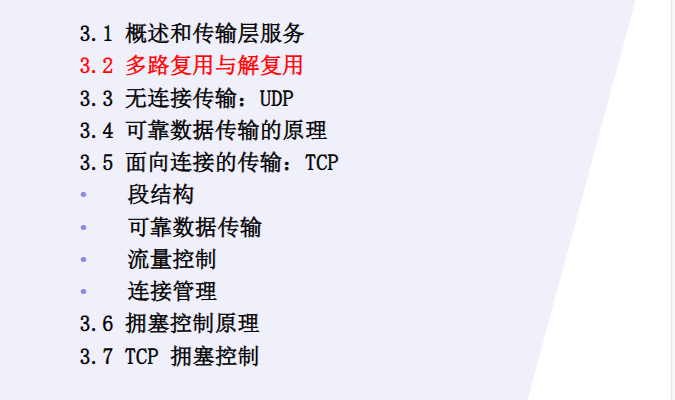

## 概述和传输层服务

**一句话说明**  
传输层解决的是：**不同主机上的应用进程之间如何进行端到端通信。**

**正式定义**  
传输层位于应用层和网络层之间，为运行在不同主机上的应用进程提供逻辑通信服务。、

**核心区别：网络层 vs 传输层**

|层次|通信对象|关键词|
|---|---|---|
|网络层|主机到主机|IP、路由、转发|
|传输层|进程到进程|端口、TCP、UDP|

**传输层主要服务**

- 进程到进程的逻辑通信
- 多路复用与解复用
- 差错检测
- 可靠传输，TCP 提供
- 流量控制，TCP 提供
- 拥塞控制，TCP 提供

**TCP 和 UDP 总览**

|协议|特点|
|---|---|
|TCP|面向连接、可靠、按序、字节流、流量控制、拥塞控制|
|UDP|无连接、不可靠、面向报文、开销小、时延低|

**易错点**

1. 传输层不是负责“主机到主机”，那是网络层。
2. UDP 不提供可靠传输，但仍有差错检测。
3. TCP 的可靠性是传输层提供的，不是 IP 提供的。
4. 拥塞控制是防止网络被压垮；流量控制是防止接收方被发太快。

---

## 多路复用与解复用

**一句话说明**  
多路复用与解复用解决的是：**一台主机上多个应用进程如何共享网络，并把收到的数据交给正确进程。**

**正式定义**

**多路复用 multiplexing**：

> 发送端传输层从多个应用进程收集数据，为每段数据加上传输层首部，包括端口号等信息，然后交给网络层发送。

**解复用 demultiplexing**：

> 接收端传输层根据报文段首部中的端口号等信息，将收到的数据交付给正确的应用进程。

**关键字段**

- 源端口号
- 目的端口号
- UDP/TCP 校验和
- TCP 还会有序号、确认号等字段

**端口号作用**

|标识|作用|
|---|---|
|IP 地址|标识主机|
|端口号|标识主机中的应用进程|
|socket|应用进程与运输层接口|

**UDP socket 标识**

UDP 是无连接的。接收端主要根据：

```
目的 IP 地址 + 目的端口号
```

把 UDP 数据报交给对应 socket。  
同一个 UDP socket 可以接收来自不同源 IP、源端口的数据。

**TCP socket 标识**

TCP 是面向连接的。一个 TCP 连接由四元组标识：

```
源 IP 地址
源端口号
目的 IP 地址
目的端口号
```

所以 TCP 服务器可以用同一个欢迎端口，同时服务多个客户端连接。

**对比表**

|项目|UDP|TCP|
|---|---|---|
|是否连接|无连接|面向连接|
|socket 标识|目的 IP + 目的端口|四元组|
|是否区分不同客户端|同一目的端口可接收多个来源|不同四元组对应不同连接|
|典型例子|DNS|HTTP|

**易错点**

1. 端口号不是标识主机，IP 才标识主机。
2. UDP 不用四元组区分 socket，接收端主要看目的 IP 和目的端口。
3. TCP 连接必须用四元组唯一标识。
4. 多路复用是发送端做，解复用是接收端做。
5. **服务器的同一个端口可以对应多个 TCP 连接，因为四元组不同**。

---

**一句话说明**  
UDP 解决的是：**应用想用尽可能简单、低开销的方式发送报文，不要求传输层保证可靠性。**

**正式定义**  
UDP，即 User Datagram Protocol，用户数据报协议，是一种无连接的传输层协议，提供不可靠、尽力而为的报文交付服务。

#### **1. UDP 主要特点**

|特点|含义|
|---|---|
|无连接|发送前不建立连接|
|不可靠|不保证到达、不保证按序、不保证不重复|
|面向报文|应用交给 UDP 的报文会作为一个 UDP 数据报发送|
|首部小|UDP 首部只有 8 字节|
|开销小、时延低|适合简单查询、实时应用|
|有校验和|可进行差错检测|

#### **2. UDP 报文段结构**

UDP 首部 4 个字段，每个字段 2 字节：

```
源端口号
目的端口号
长度
校验和
```

总首部长度：

```
4 × 2 Byte = 8 Byte
```

#### **3. UDP 为什么还要校验和？**

因为 UDP 虽然不保证可靠传输，但仍需要**检测传输过程中比特是否出错**。  
校验和只能检测差错，不能保证恢复差错。

标准答案：

> UDP 校验和用于检测 UDP 报文段在传输过程中是否出现比特差错。如果检测到差错，接收方可丢弃该报文段，但 UDP 本身不负责重传。

#### 4.校验和的计算

#### **5. 哪些应用常用 UDP？**

|应用|原因|
|---|---|
|DNS|查询短小，要求时延低|
|实时音视频|可容忍少量丢包，更关注实时性|
|网络游戏|低时延优先|
|DHCP|常使用 UDP|

#### **6. UDP 与 TCP 对比**

| 比较项  | UDP       | TCP           |
| ---- | --------- | ------------- |
| 连接   | 无连接       | 面向连接          |
| 可靠性  | 不可靠       | 可靠            |
| 顺序   | 不保证按序     | 按序交付          |
| 数据形式 | 报文        | 字节流           |
| 首部   | 8 字节      | 至少 20 字节      |
| 控制机制 | 无拥塞/流量控制  | 有流量控制、拥塞控制    |
| 典型应用 | DNS、实时音视频 | HTTP、FTP、SMTP |

**易错点**

1. UDP 不可靠不等于完全不检查错误，它有校验和。
2. UDP 是传输层协议，不是应用层协议。
3. UDP 面向报文，TCP 面向字节流。
4. DNS 通常用 UDP 不是因为“可靠”，而是因为查询短小、开销小、时延低。
5. UDP 不建立连接，所以没有三次握手。

---

## 可靠数据传输的原理

**一句话说明**  
可靠数据传输解决的是：**在可能丢包、出错的网络上，如何让上层看到的数据像可靠传输一样正确、按序到达。**

#### **1. 可靠传输常用机制**

|机制|作用|
|---|---|
|校验和|检测比特差错|
|ACK|肯定确认，表示正确收到|
|NAK|否定确认，表示收到但出错|
|序号|区分新分组和重复分组|
|定时器|检测分组或 ACK 丢失|
|超时重传|超时未收到 ACK 就重传|
|滑动窗口|支持流水线发送，提高利用率|

#### **2. rdt 版本演进**

| 协议     | 信道情况          | 加入机制           |
| ------ | ------------- | -------------- |
| rdt1.0 | 信道完全可靠        | 不需要差错控制        |
| rdt2.0 | 分组可能出错        | 校验和、ACK、NAK、重传 |
| rdt2.1 | ACK/NAK 也可能出错 | 序号             |
| rdt2.2 | 不使用 NAK       | 用重复 ACK 代替 NAK |
| rdt3.0 | 分组或 ACK 可能丢失  | 定时器、超时重传       |
**高频解释**

- **为什么需要序号？**  
    为了区分新分组和重传的重复分组，避免接收方重复交付。
    
- **为什么需要定时器？**  
    因为分组或 ACK 可能丢失，发送方无法一直等待，超时就重传。
    
- **ACK 丢失会怎样？**  
    发送方超时后重传分组；接收方通过序号识别重复分组，不重复交付，并重新发送 ACK。
    

#### **3. 停等协议**

停等协议：

```
发送一个分组
→ 等待 ACK
→ 收到 ACK 后再发送下一个分组
```

优点：简单。  
缺点：链路利用率低，尤其 RTT 大、带宽高时效率很差。

利用率常见公式：

```
U_sender = L/R / (RTT + L/R)
```

忽略 ACK 传输时间时使用。

#### **4. 流水线协议**

为提高效率，允许发送方在未收到前面 ACK 时连续发送多个分组。

```
一次发送多个分组
→ ACK 陆续返回
→ 窗口向前滑动
```

典型协议：

- GBN，Go-Back-N
- SR，Selective Repeat

**易错点**

1. ACK 丢失不等于数据一定丢失。
2. 重传可能导致重复分组，所以必须有序号。
3. rdt3.0 解决的是丢包问题，引入定时器。
4. 停等协议简单但效率低。
5. 流水线提高效率，但需要窗口机制和更复杂的缓存/确认。

#### 5.GBN vs SR

|项目|GBN|SR|
|---|---|---|
|全称|Go-Back-N|Selective Repeat|
|接收窗口|通常为 1|大于 1|
|乱序分组|丢弃|缓存|
|ACK|累积 ACK|单独 ACK|
|超时重传|从丢失分组开始，重传后续所有已发送未确认分组|只重传超时/丢失的那个分组|
|接收方复杂度|低|高|
|信道利用率|较低|较高|

**序号大小与窗口大小之间的关系**


设序号字段为 `k` bit，序号空间大小：

```
N = 2^k
```

GBN：

```
发送窗口 W <= 2^k - 1
```

SR：

```
发送窗口 W <= 2^(k-1)
```

**例**：
如果序号字段为 `5 bit`：

1. 序号空间大小是多少？
2. GBN 最大发送窗口是多少？
3. SR 最大发送窗口是多少？
```
1.序号空间大小 = 2^5 = 32  序号范围 = 0 ~ 31
2.
```