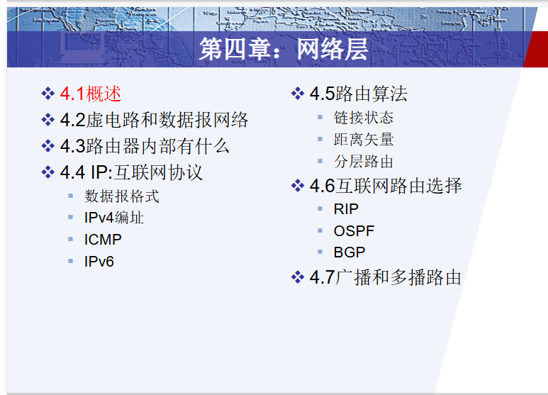

## 概述

网络层解决的是：**把分组从源主机送到目的主机。**

**正式定义**  
网络层为主机到主机提供通信服务，主要负责将运输层交下来的报文段封装成网络层数据报，并通过路由器逐跳转发到目的主机。

**两个核心功能**

|功能|含义|范围|
|---|---|---|
|转发 forwarding|路由器把到达输入端口的分组转移到合适的输出端口|单个路由器内部|
|路由选择 routing|决定分组从源到目的地经过的路径|整个网络范围|

**必背区别**

> 转发是局部动作，发生在单台路由器中；路由选择是全局过程，用于计算从源到目的地的路径。

---
## 虚电路和数据报网络

**一句话说明**  
这一节解决的是：**网络层转发分组时，是先建立连接再转发，还是每个分组独立转发。**

#### **1. 虚电路网络 VC**

虚电路网络特点：

```
建立连接 → 数据传输 → 释放连接
```

在传输数据前，先建立一条逻辑连接，也叫虚电路。  
每个分组携带的是 **VC 号**，路由器根据 VC 号转发。

虚电路网络中路由器需要维护连接状态：

```
入接口 + 入 VC 号 → 出接口 + 出 VC 号
```

特点：

- 通信前需要建立连接
- 路由器维护每条虚电路的状态
- 同一连接的分组通常沿相同路径转发
- 转发表依据 VC 号
- 典型例子：ATM、帧中继

#### **2. 数据报网络 datagram network**

数据报网络特点：

> 每个分组独立携带目的地址，路由器根据目的地址和转发表独立转发。

特点：

- 通信前不建立网络层连接
- 路由器不维护端到端连接状态
- 每个分组携带目的 IP 地址
- 不同分组可能走不同路径
- Internet 采用数据报网络

#### **3. 对比表**

|比较项|虚电路网络|数据报网络|
|---|---|---|
|是否建立连接|传输前建立虚电路|不建立网络层连接|
|分组携带信息|VC 号|目的地址|
|路由器状态|维护连接状态|不维护端到端连接状态|
|转发依据|VC 号和接口|目的地址/最长前缀匹配|
|路径|同一连接通常同一路径|分组可能走不同路径|
|失败影响|路由器故障会影响经过的虚电路|可重新路由，较灵活|
|典型网络|ATM、帧中继|Internet|

---

## **路由器内部有什么**

#### **路由器四个组成部分**

|部分|作用|
|---|---|
|输入端口|接收分组，查找转发表，决定输出端口|
|交换结构|把分组从输入端口转移到输出端口|
|输出端口|缓存并发送分组到下一条链路|
|路由选择处理器|运行路由协议，计算/维护转发表|

#### **核心流程**

```
分组到达输入端口
→ 检查首部
→ 查找转发表
→ 通过交换结构送到输出端口
→ 输出端口排队
→ 发送到下一跳
```

#### **交换结构三种方式**

|方式|特点|
|---|---|
|经内存交换|输入端口把分组交给内存，再由输出端口取出，速度受内存限制|
|经总线交换|多个端口共享总线，一次通常只能传一个分组|
|经互联网络交换|如 crossbar，可并行交换，性能较好|

#### **排队问题**

输入端口可能排队，输出端口也可能排队。
##### 输入端口排队

如果交换结构的转发速度慢于输入端口的到来数据总和 ，则输入队列可能会出现排队

重点：**HOL 阻塞**  
队首阻塞指输入队列最前面的分组因为目标输出端口忙而不能转发，导致后面的分组即使目标端口空闲也被阻塞。

##### **输出端口排队**

如果多个输入端口同时把分组送往同一个输出端口，就会在输出端口排队。队列满了会丢包。

常见调度方式：

- FIFO：先来先服务
- 优先级调度：高优先级先发
- 轮询调度：不同队列轮流发送

**易错点**

1. 路由选择处理器负责计算转发表；输入端口通常负责查表转发。
2. 路由器转发依据是网络层地址，不是端口号。
3. HOL 阻塞发生在输入队列。
4. 输出端口排队可能导致丢包。
5. 交换结构不是“交换机”，是路由器内部的数据转移结构。

---

## 互联网协议

### IPv4 数据报格式

**IPv4 数据报结构**

```
IP 首部 + 数据部分
```

数据部分通常封装的是传输层报文段，比如 TCP 段或 UDP 段。

#### **1. IPv4 首部常见字段**

|字段|作用|
|---|---|
|版本号|IPv4 为 4|
|首部长度|指出 IP 首部有多长|
|服务类型 TOS|区分服务质量|
|总长度|IP 数据报总长度，包含首部和数据|
|标识 Identification|分片后用于识别属于同一原始数据报|
|标志 Flags|DF、MF 等分片控制|
|片偏移 Fragment Offset|表示该片数据在原始数据部分中的位置|
|TTL|生存时间，每经过一个路由器减 1|
|协议字段 Protocol|指明上层协议，如 TCP=6，UDP=17|
|首部校验和|检测 IP 首部差错|
|源 IP 地址|发送主机 IP|
|目的 IP 地址|接收主机 IP|

#### **2. TTL**

TTL：Time To Live，生存时间。

作用：

> 防止数据报在网络中无限循环。

每经过一个路由器：

```
TTL = TTL - 1
```

当 TTL 变为 0 时，路由器丢弃该数据报，并通常发送 ICMP 差错报文。

#### **3. 协议字段**

Protocol 字段说明 IP 数据部分应该交给哪个上层协议。

常见：

```
TCP = 6
UDP = 17
ICMP = 1
```

#### **4. 分片相关字段**

|字段|作用|
|---|---|
|标识 Identification|同一原始数据报的所有分片具有相同标识|
|DF|Don’t Fragment，1 表示不允许分片|
|MF|More Fragments，1 表示后面还有分片，0 表示最后一片|
|片偏移|单位是 8 Byte，表示本片数据在原始数据部分的位置|

**易错点**

1. IP 总长度包含首部和数据。
2. MTU 也包含 IP 首部和数据。
3. 片偏移单位是 8 Byte。
4. 除最后一片外，数据长度必须是 8 Byte 整数倍。
5. 同一原始数据报的所有分片标识字段相同。
6. IP 首部校验和只校验 IP 首部，不校验数据部分。

---

### IPv4 编址

#### **1. IPv4 地址基本概念**

IPv4 地址长度：

```
32 bit = 4 Byte
```

常写成点分十进制：

```
192.168.1.1
```

每个十进制数对应 8 bit，范围：

```
0 ~ 255
```

注意：IP 地址不是分配给“主机整体”，严格说是分配给**接口 interface**。  
一台路由器有多个接口，所以通常有多个 IP 地址。

#### **2. 子网与前缀**

CIDR 表示法：

```
192.168.1.0/24
```

含义：

- 前 24 bit 是网络前缀
- 后 8 bit 是主机部分

子网掩码：

```
/24 = 255.255.255.0
```

常见前缀：

|前缀|掩码|可用主机数|
|---|---|---|
|/24|255.255.255.0|254|
|/25|255.255.255.128|126|
|/26|255.255.255.192|62|
|/27|255.255.255.224|30|
|/28|255.255.255.240|14|
|/29|255.255.255.248|6|
|/30|255.255.255.252|2|

可用主机数：

```
2^(主机位数) - 2
```

减 2 是因为：

- 主机位全 0：网络地址
- 主机位全 1：广播地址

#### **3. 网络地址怎么算**

```
网络地址 = IP 地址 AND 子网掩码
```

例如：

```
192.168.1.130/26
```

`/26` 每个子网块大小：

```
256 - 192 = 64
```

子网范围：

```
192.168.1.0 ~ 63
192.168.1.64 ~ 127
192.168.1.128 ~ 191
192.168.1.192 ~ 255
```

所以 `192.168.1.130/26` 属于：

```
网络地址：192.168.1.128
广播地址：192.168.1.191
可用主机：192.168.1.129 ~ 192.168.1.190
```

**4. 易错点**

1. IPv4 地址是 32 bit。
2. IP 地址分配给接口，不是只给主机。
3. `/n` 表示前 n 位是网络前缀。
4. 主机位全 0 是网络地址，不能分配给普通主机。
5. 主机位全 1 是广播地址，不能分配给普通主机。
6. 可用主机数是 `2^主机位 - 2`。
---
### 最长前缀匹配

---

### DHCP 与 NAT

一句话：  
**DHCP 用来让主机自动获得 IP 地址等网络配置信息。**

DHCP 可分配：

- IP 地址
- 子网掩码
- 默认网关
- DNS 服务器地址

DHCP 四步，必须背：

```
Discover → Offer → Request → ACK
```

口诀：**发现、提供、请求、确认**。

标准表述：

> DHCP 是动态主机配置协议，用于主机自动获取 IP 地址、子网掩码、默认网关和 DNS 服务器等配置信息。其典型过程为 Discover、Offer、Request、ACK。

**NAT**

一句话：  
**NAT 用来让多个内网主机共享一个或少量公网 IP 访问互联网。**

核心思想：

```
内网 IP + 端口  ↔  公网 IP + 新端口
```

NAT 路由器会维护转换表，例如：

```
192.168.1.2:5000  →  202.1.1.1:62001
192.168.1.3:5000  →  202.1.1.1:62002
```

优点：

- 节省 IPv4 公网地址
- 隐藏内部网络结构
- 内网地址可重复使用

易错点：

- NAT 改的是 IP 地址和端口映射。
- NAT 不是 DNS。
- 私有地址不能直接在公网路由。
- NAT 会破坏端到端透明性。

---

### **ICMP 与 IPv6**

**ICMP**

一句话：  
**ICMP 用于在 IP 层报告差错和传递控制信息。**

常见用途：

- `ping`：使用 ICMP Echo Request / Echo Reply 测试连通性
- `traceroute`：利用 TTL 逐跳递增和 ICMP 差错报文探测路径

ICMP 常见报文：

- 目的不可达
- TTL 超时
- 回显请求/回显应答

易错点：

- ICMP 不是传输层协议。
- ICMP 通常封装在 IP 数据报中。
- ping 不是 TCP 或 UDP 应用。

**IPv6**

一句话：  
**IPv6 主要为了解决 IPv4 地址不足，并改进 IP 首部处理。**

IPv6 关键点：

- 地址长度：128 bit
- 固定首部：40 Byte
- 不在路由器中分片
- 没有首部校验和
- 使用 Next Header 字段指明后续首部/上层协议
- Hop Limit 类似 IPv4 的 TTL

IPv4 vs IPv6 高频对比：

|项目|IPv4|IPv6|
|---|---|---|
|地址长度|32 bit|128 bit|
|首部长度|可变|固定 40 Byte|
|分片|路由器和主机可分片|路由器不分片|
|首部校验和|有|无|
|TTL|TTL|Hop Limit|
|上层协议字段|Protocol|Next Header|

IPv4 到 IPv6 过渡：

- 双协议栈 dual stack
- 隧道 tunneling

---

## 路由算法

