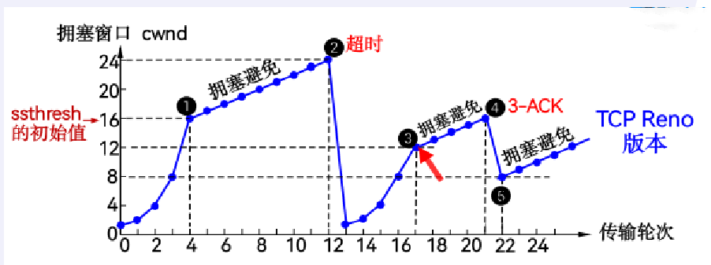
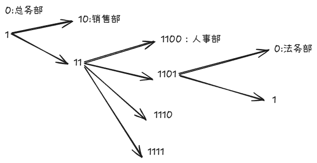
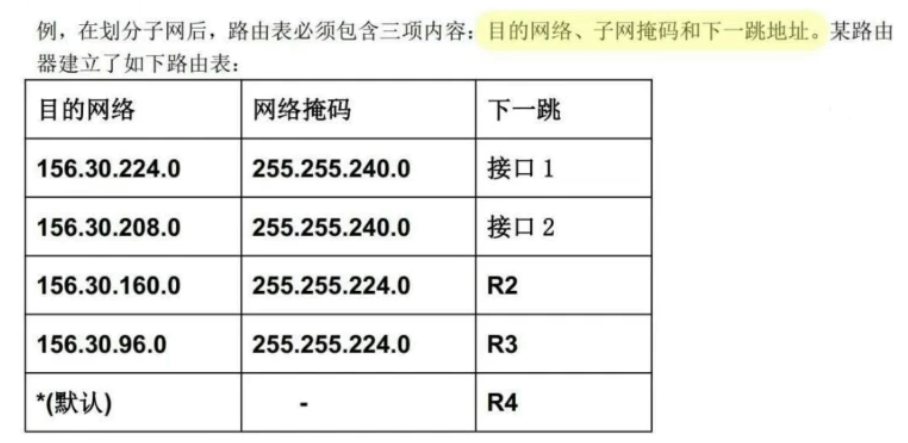
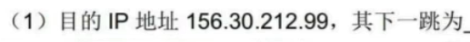
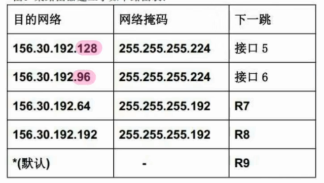
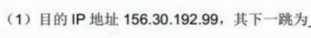
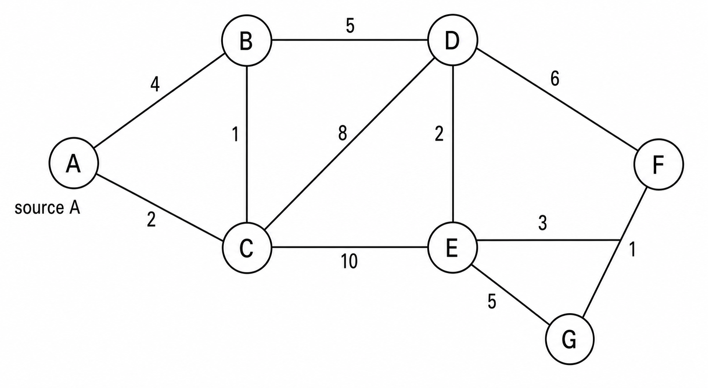
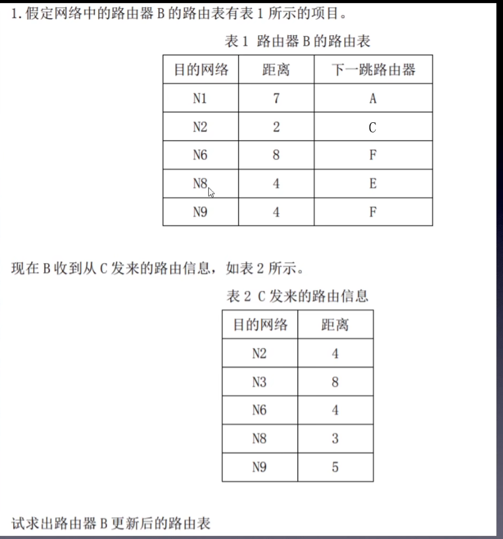

# 时延、吞吐量与带宽计算

## 1.时延

| 时延   | 含义               | 公式/特点             |
| ---- | ---------------- | ----------------- |
| 处理时延 | 检查首部、差错检测、决定输出链路 | 通常题目会直接给          |
| 排队时延 | 分组在路由器队列中等待转发    | 最不稳定，和拥塞有关        |
| 传输时延 | 把整个分组推送到链路上所需时间  | `d_trans = L / R` |
| 传播时延 | 比特在链路上传播所需时间     | `d_prop = d / s`  |
```
L：分组长度，单位 bit
R：链路传输速率，单位 bit/s
d：链路长度，单位 m
s：传播速度，单位 m/s
```
**传输时延**：L/R

**传播时延**：d/s

**端到端时延**：处理时延 + 排队时延 + 传输时延 + 传播时延

```
d_nodal = d_proc + d_queue + d_trans + d_prop
```

如果题目说“**忽略处理和排队**”，就只算：传输时延 + 传播时延

## 2.吞吐量

|概念|考试表述|
|---|---|
|带宽/链路速率|链路理论上每秒可传输的比特数，单位 bps|
|吞吐量|实际单位时间内成功传输的数据量|
|瓶颈链路|路径中传输速率最小的链路|
|端到端吞吐量|通常由瓶颈链路决定，约为 `min{R1, R2, ...}`|

```
端到端吞吐量 = 路径中最小链路速率
```
例如服务器到客户端经过三条链路：10 Mbps、100 Mbps、5 Mbps。  
最大吞吐量约为：**5 Mbps**。

## 3.流量强度

流量强度公式：

```
I = La / R
```

其中：

```
L：分组长度，单位 bit
a：平均分组到达率，单位 packet/s
R：链路传输速率，单位 bit/s
```

La/R ≈ 0：队列很空，排队时延很小
La/R 接近 1：队列时延急剧增大
La/R > 1：到达速度超过服务速度，队列无限增长，系统拥塞

## 4.时延带宽积

**时延带宽积 = 传播时延 X 带宽**


> [!NOTE] 注意
>1.`B` 字节要先换成 bit：`1 Byte = 8 bit`。
>2.`Mbps = 10^6 bit/s`，不是 `10^6 Byte/s`。
>3.传输时延看 **分组长度和链路速率**。
>4.传播时延看 **距离和传播速度**，和分组大小无关。
>5.带宽大不等于实际吞吐量一定大，吞吐量受瓶颈链路、拥塞等影响。

---

# RTT的计算

## 1.非持续http

```
1 RTT：建立 TCP 连接
1 RTT：发送 HTTP 请求并收到响应开始
总计约 2 RTT
```

如果一个网页有 1 个 HTML 文件 + 3 张图片，非持续连接且不并行，忽略传输时间：

```
对象数 = 4
总时延约 = 4 × 2RTT = 8RTT
```

即总时延=2n个RTT

## 2.持续http

### 非流水线

特点：多个对象共用一个 TCP 连接，但客户端必须等上一个响应回来后，才请求下一个对象。

忽略传输时间：

```
1 RTT：建立 TCP 连接
1 RTT：请求并收到 HTML 响应开始
每个后续对象：1 RTT
```

如果一个网页有 1 个 HTML 文件 + 3 张图片

```
总时延 = 1RTT + 1RTT + 3RTT
       = 5RTT
```

**公式**：
```
总对象数 = M
持续 HTTP 非流水线 ≈ 1RTT + M × 1RTT = (M + 1)RTT
```

### 流水线

特点：HTML 返回后，客户端可以连续发送多个对象请求，不必一个一个等响应。

```
1 RTT：建立 TCP 连接
1 RTT：请求 HTML
1 RTT：同时请求所有图片/CSS/JS 等对象
```

如果一个网页有 1 个 HTML 文件 + 3 张图片

```
1 个 HTML + 3 张图片 ≈ 3RTT
```

**公式**：
```
持续 HTTP 流水线 ≈ 1RTT 建连接 + 每一轮对象发现/请求 1RTT
```

如果页面对象有多轮依赖，就不是 3RTT。

例如：

```
HTML 引用 CSS
CSS 里又引用背景图片
```
就是：
```
1 RTT：建 TCP
1 RTT：取 HTML
1 RTT：取 CSS
1 RTT：取 CSS 中发现的图片
总计 ≈ 4RTT
```

---

# UDP校验和计算

**发送方计算**

1. 把参与校验的数据按 **16 bit** 分组。  
    如果最后不足 16 bit，末尾补 0。
    
2. 将所有 16 bit 字进行**反码加法**。  
    普通二进制相加，但如果最高位产生进位，要把进位**回卷加到最低位**。
    
3. 得到总和后，对结果**按位取反**。
    
4. 取反后的 16 bit 结果就是校验和，填入 UDP 首部的校验和字段。
    

```
数据分组相加 → 进位回卷 → 最后取反 → 得到校验和
```

**接收方验证**

1. 接收方把收到的所有 16 bit 字，包括**校验和**，一起做反码加法。
    
2. 如果结果是：
    

```
1111111111111111
```

表示**未检测到差错**。

3. 如果结果不是全 1，表示**检测到差错**。

**例题**

某 UDP 报文段参与校验的 16 位字如下：

```
Word1 = 0101010101010101
Word2 = 0011001100110011
Word3 = 0000111100001111
```

求发送方应填入的 UDP 校验和。

**答案**

第一步：Word1 + Word2

```
  0101010101010101
+ 0011001100110011
= 1000100010001000
```

第二步：继续加 Word3

```
  1000100010001000
+ 0000111100001111
= 1001011110010111
```

没有最高位进位，所以不用回卷。

第三步：按位取反

```
求和结果：1001011110010111
校验和：  0110100001101000
```

所以发送方应填入的 UDP 校验和是：

```
0110100001101000
```

接收方验证时，把三个 Word 和校验和一起相加，若结果为：

```
1111111111111111
```

则认为未检测到差错。

---

# 链路利用率的计算

```
U = (L / R) / (RTT + L / R + ACK) X100%
```

更确切的说是
```
 U = T发送/T总时间 x100%
```

其中：

```
L：分组长度，单位 bit
R：链路速率，单位 bit/s
L/R：传输时延
RTT：往返传播时间
U：链路利用率
ACK:ACK确认帧的时间，不过大部分题目都忽略
```

如果题目给的是单向传播时延 `d_prop`：

```
RTT = 2 × d_prop
```

分组长度= 帧数x帧长

**对于GBN和SR这种**，链路利用率计算时，分子的时间是所有帧的发送时间，分母则是一个帧的发送时间，因为一个RTT内传的是所有帧，不是一个帧计算一个RTT
即：

```
所有帧长度/传输速率 / 一个帧长度/传输速率+RTT+ACK确认帧时间 = U
```

**例题**（最简单的一种）

分组长度 `1500 Byte`，链路速率 `10 Mbps`，RTT = `50 ms`，求停等协议发送方利用率。

```
L = 1500 × 8 = 12000 bit
R = 10 Mbps = 10 × 10^6 bit/s
```

传输时延：

```
d_trans = L / R
        = 12000 / (10 × 10^6)
        = 0.0012 s
        = 1.2 ms
```

利用率：

```
U = 1.2 / (1.2 + 50)
  = 1.2 / 51.2
  ≈ 0.0234
  = 2.34%
```

**注意**：记得换单位

---

# TCP的Seq与ACK计算

已知：

```
Seq = x
数据长度 = L
```

则：

```
本段字节范围 = x ~ x+L-1
下一个 Seq = x+L
对方确认号 Ack = x+L
```

---

# 拥塞控制算法



纵轴：拥塞窗口 `cwnd`  
横轴：传输轮次 RTT  
核心变量：`ssthresh` 慢启动门限

**1. 慢启动阶段**

图左边一开始：

```
cwnd：1 → 2 → 4 → 8 → 16
```

这是**慢启动**。名字叫慢启动，但增长并不慢，而是**指数增长**，每经过一个 RTT，`cwnd` 近似翻倍。

到 `cwnd = 16` 时达到初始 `ssthresh`，于是进入拥塞避免。

**2. 拥塞避免阶段**

达到 `ssthresh = 16` 后：

```
cwnd：16 → 17 → 18 → ... → 24
```

这是**拥塞避免**。窗口不再翻倍，而是**线性增长**，大约每 RTT 增加 `1 MSS`。

**3. 发生超时 timeout**

图中 `cwnd = 24` 左右发生 **超时**。

超时被认为是比较严重的拥塞，所以 TCP 采取强烈降速：

```
ssthresh = 当前 cwnd / 2 = 24 / 2 = 12
cwnd = 1 MSS
重新进入慢启动
```

所以图中窗口从 24 直接掉到 1，然后又开始：

```
1 → 2 → 4 → 8 → 12
```

到达新的 `ssthresh = 12` 后，再进入拥塞避免。

**4. 收到 3 个冗余 ACK**

后面 `cwnd` 线性增长到大约 16 时，图中出现 **3-ACK**。

3 个冗余 ACK 表示可能只是个别分组丢失，拥塞程度比超时轻。TCP Reno 会触发：

```
快速重传 + 快速恢复
ssthresh = 当前 cwnd / 2 = 16 / 2 = 8
cwnd 降到 ssthresh 附近，即 8
进入拥塞避免
```

所以图中不是掉到 1，而是从 16 降到 8，然后继续线性增长。

**核心对比**

|事件|TCP 判断|ssthresh|cwnd|后续阶段|
|---|---|---|---|---|
|达到 ssthresh|进入谨慎增长|不变|不再翻倍|拥塞避免|
|超时|严重拥塞|当前 cwnd/2|变为 1 MSS|慢启动|
|3 个冗余 ACK|轻度拥塞/个别丢包|当前 cwnd/2|降到 ssthresh 附近|拥塞避免|

**考试模板**

> TCP 拥塞控制开始采用慢启动，`cwnd` 从 1 MSS 开始指数增长；当 `cwnd` 达到 `ssthresh` 后进入拥塞避免，窗口线性增长。若发生超时，认为拥塞严重，将 `ssthresh` 设为当前 `cwnd` 的一半，并把 `cwnd` 降为 1 MSS，重新慢启动。若收到 3 个冗余 ACK，则触发快速重传和快速恢复，将 `ssthresh` 设为当前 `cwnd` 的一半，`cwnd` 降到门限附近，然后进入拥塞避免。

记忆口诀：

```
慢启动：指数涨
拥塞避免：线性涨
超时：砍半门限，窗口归 1
三冗余 ACK：砍半窗口，不归 1
```

---
# 数据报分片

形如：

已知一个分组的数据部分长度为3800字节，网络规定分组的分片长度不能超过1420字节，假设IP分组的首部采用固定首部20个字节。请问原始分组需要分成几个分片？每个分片的总长度、标识字段（注：原始分组标识字段是666）、DF标志
位（注：0表示可分片，1表示不可分片)、MF标志位（注：0表示是最后分片，1表示后面还有分片）、分片偏移字段各是多少？


> [!NOTE] 注意
> 1.数据报长度是包含首部的，数据部分长度不包含首部
> 2.TCP首部为20字节，UDP为8字节，如果题目没说就是20字节
> 3.标识字段用于判断该分片是哪一个分组的，这里都是一个分组所以都是666
> 4.MF表示该分片后是否还有分片，第1，2片后都还有，但是第3片是最后一片，所以MF为0
> 5.DF表示该分片是否还可以分片，这里都是已经分片过的，所以都是0

| 分片    | 数据部分长度 | 分片总长度 | 标识字段 | DF  | MF  | 分片偏移 |
| ----- | ------ | ----- | ---- | --- | --- | ---- |
| 第 1 片 | 1400   | 1420  | 666  | 0   | 1   | 0    |
| 第 2 片 | 1400   | 1420  | 666  | 0   | 1   | 175  |
| 第 3 片 | 1000   | 1020  | 666  | 0   | 0   | 350  |

计算步骤

给定：

```
原始 IP 数据报总长度 = 3820
IP 首部长度 = 20
MTU = 1420
```

第一步：算原始数据部分长度

```
原始数据长度 = 3820-20 =3800
```

第二步：算每片最多能装多少数据

```
每片最大数据量 = 1420-20 =1400
```

但除最后一片外，必须取 8 的整数倍：

```
每片数据量 = 用原始数据长度 除以 每片最大数据量；这里就是3800除以1400=2...1000
```

说明可以分为3组，前两组为1400最后一组是1000

第三步：依次分片。

第四步：算每片字段：

```
分片总长度 = IP首部长度 + 本片数据长度：即1420 1420 1020
片偏移 = 本片数据起始位置 / 8；第一组是0-1399，第二组是1400-2799；第三组是2800-3799；就分别用0 1400 2800除以8，得到的商就是片偏移
```

---

# 子网划分

### 1.已知主机数

- 求主机位数：2^n -2>=主机数，求得n=6
- 则网络位数为32-6=26
- 原网络位为24,则需要借2位
- 192.168.18.00/00/0000,两个/之间的就是借的位，可以是00,01,10,11，故可以分为4个子网
- 代入其中得网络地址分别为192.168.18.0,192.168.18.64,192.168.18.128,192.168.18.192
- 因为是定长划分，故子网掩码都是一样的，26位网络位，意味着前26位都是1,后6位全是0,即255.255.255.192
- 最大和最小就是将还未借的位设位1110,0001,最大的最后一位要为0其他位设为1,最小的最后一位要为1，其他位为0

### 2.定长划分

- 求需要借的位：2^n -2>=6,所以需要借的位为3位，则子网的网络位为24+3=27，主机位为32-27=5
- 193.160.80./000/00000，两个/之间的就是借的位，可以是000,001,010,011,100,101
- 当主机位都是为0时，得出网络地址，当主机位都是1时，得出广播地址
- 主机位除了最后一位都取1时得最大地址；最后一位取1，其他位都是0时，得最小地址；
- 因为是定长划分，子网掩码都一样，都是255.255.255.224
### 3.不定长划分

- 按照主机数从大到小来划分，先划分500的
- 2^n -2>=500,n=9,所以主机位为9位，网络位位32-9=23,在原来的基础上借1位
- 即172.20.000000/0/0.00000000,得出网络地址，子网掩码，最小和最大地址
- 然后是销售部：2^n -2>=200,n=8,主机位8位，网络位24位，这时要在总部要已经划分过的基础上再划分,再23->24借1位
- 即172.20.0000001/0/.00000000,得出要求的东西
- 以此类推，人力部2^n -2>=50,n=6,主机位为6,网络位26,24->26,在销售部基础上再借2位
- 即172.20.00000011./00/000000,得出要求的东西
- 最后是法务部2^n -2>=20,n=5,主机位5位，网络位27位，26->27,在人力部基础上再借1位
- 即172.20.00000011.01/0/00000,得出要求的东西
- 如图所示：



---
# 最长前缀匹配



- 先拆子网掩码255.255.240.0和255.255.224.0，分别是00000000.00000000.11110000.00000000和00000000.00000000.11100000.00000000
- 然后将目的IP和子网掩码做与运算(都为1时才为1,其他都是0),得到目的网络
- 两个子网掩码都要运算，这里的结果是156.30.208.0和156.30.192.0,但是192的没有所以选208的，所以下一跳是接口2


上面一样的思路，但是可以得到两个结果，这时需要按照最长前缀匹配来做判断
```
看哪一个的网络位更多，就选哪一个
```

---

# 链路状态算法（Dijkstra的使用）


```
A-B = 4
A-C = 2
B-C = 1
B-D = 5
C-D = 8
C-E = 10
D-E = 2
D-F = 6
E-F = 3
E-G = 5
F-G = 1
```

|目的节点|最短路径|代价|下一跳|
|---|---|---|---|
|B|A-C-B|3|C|
|C|A-C|2|C|
|D|A-C-B-D|8|C|
|E|A-C-B-D-E|10|C|
|F|A-C-B-D-E-F|13|C|
|G|A-C-B-D-E-F-G|14|C|

---
# 距离矢量算法更新路由表




1.将发来的路由信息的距离全部+1,并添加列：下一跳路由，这里由于是C发来的